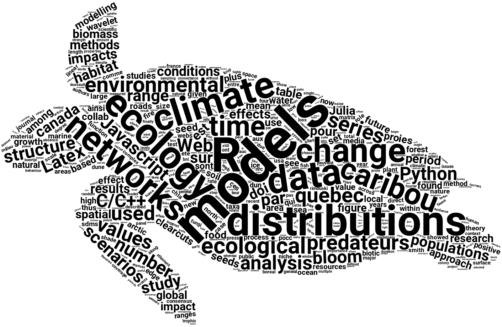

## Our worldcloud

An R script to create a worldcloud, such as the one on the first page of our
blog: https://insileco.github.io/

We first converted our publications into `.txt` files using `pdftotext`:

```bash
for f in ~/Dropbox/LetiR/publi/*.pdf; do pdftotext -enc ASCII7 -nopgbrk $f; done
```

And then use R to create the wordcloud. R packages required:

- tm
- wordcloud2
- magrittr
- htmlwidgets
- webshot


